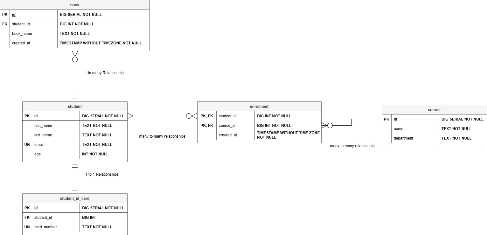
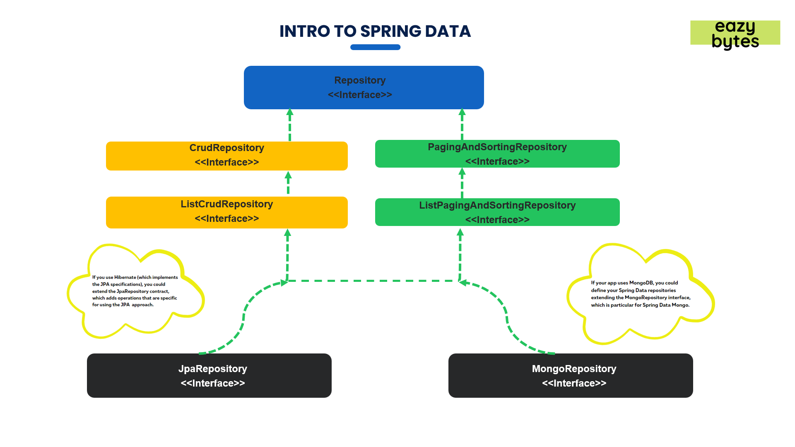
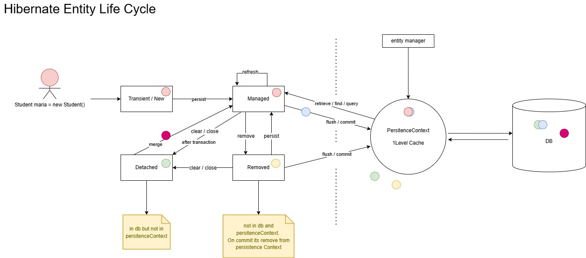
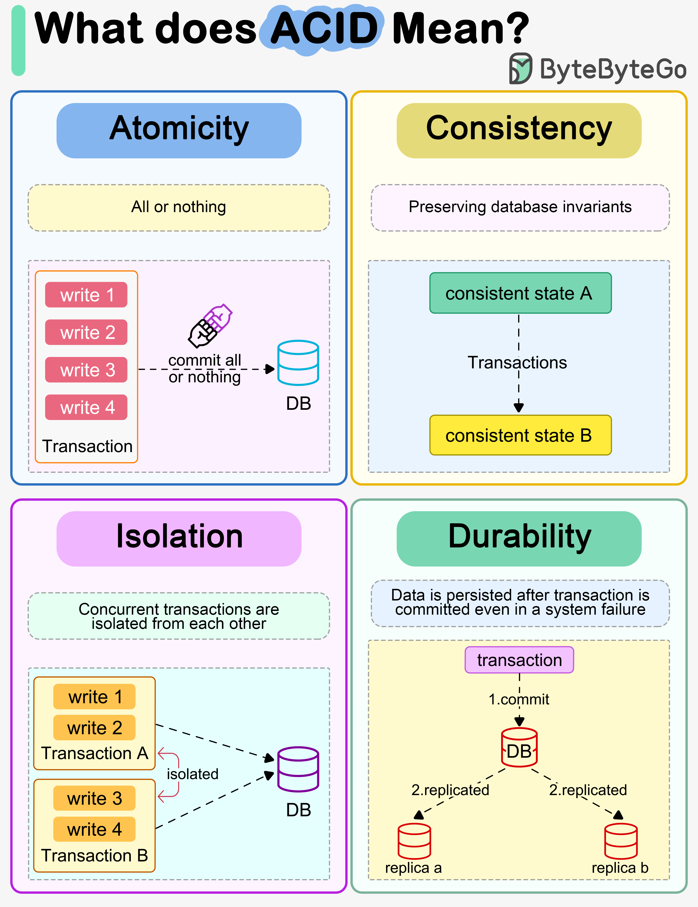

# Spring Boot + JPA Practice

This repository documents my progress learning **Spring Boot** and **JPA**, focusing on:

- Working with databases 
- Managing **entity relationships**
- Writing **efficient queries**
- Implementing **CRUD operations**, **pagination**, and **custom queries**

---
### Table of Contents:

1. 🐘 **PostgreSQL**  
2. 🚀 **Lombok**
3. 🏗️ **Spring Boot 3-Layer Architecture**
4. 🔗 **Spring Data JPA**
   - Repository Interfaces  
   - Derived Query Methods  
   - Custom Queries
   - Pagination and Sorting  
5. 🔢 **Generation Strategies**  
   - `@GeneratedValue(strategy = GenerationType.XX)`
6. 🔄 **JPA Relationships & Relationship Direction**
7. ♻️ **Hibernate Entity Lifecycle**  
   - Cascade Types in JPA  
   - Orphan Removal  
8. 🧩 **JPA Query Annotations Summary**
9. 🔐 **Transactions**  
   - Database Transactions — ACID  
   - Default Transaction Behavior in Spring Data JPA  
   - Using `@Transactional`  
   - Locking Data (Prevent Concurrent Updates)  
   - Two Main Locking Strategies  
   - Read-only Transaction Example  
   - Rollback Example (on `Throwable`)
10. 📚 **Useful Dependencies**
---

## 1. 🐘 PostgreSQL: 

1. **Install PostgreSQL**  
   Default installation path: `C:\Program Files\PostgreSQL\<version>`

2. **Add PostgreSQL `bin` folder to PATH** (optional but recommended)  
```C:\Program Files\PostgreSQL<version>\bin```
- Go to **Environment Variables → System Variables → Path → Edit → New** → paste the path → OK
3. Connect to PostgreSQL via CMD: Open **Command Prompt**:
```bash
psql -U postgres -h localhost -p 5432

# -U postgres → username
# -h localhost → host
# -p 5432 → port (default)

# Enter your password when prompted.
```

4. **Postgres Commands**:
```bash
CREATE DATABASE edu_dn; # Create db
\c edu_db               # Connect db
\l                      # lists all databases
\dt                     # View Tables 
\d                      # Describe Table
```

### ER Diagram  



## 2. 🚀 Lombok:

1. Add this to your **pom.xml** inside <dependencies>:

```xml <dependency>
    <groupId>org.projectlombok</groupId>
    <artifactId>lombok</artifactId>
    <version>1.18.32</version> <!-- use the latest version -->
    <scope>provided</scope>
    <!-- scope is provided because Lombok generates code at compile time. -->
</dependency>
```


| Lombok Annotation          | Purpose / Description                                                                        | Example / Notes                                      |
| -------------------------- | -------------------------------------------------------------------------------------------- | ---------------------------------------------------- |
| `@Getter`                  | Generates getter methods for all fields                                                      | `@Getter` on class or field                          |
| `@Setter`                  | Generates setter methods for all fields                                                      | `@Setter` on class or field                          |
| `@ToString`                | Generates `toString()` method                                                                | Can exclude fields with `@ToString.Exclude`          |
| `@EqualsAndHashCode`       | Generates `equals()` and `hashCode()` methods                                                | Can exclude fields with `@EqualsAndHashCode.Exclude` |
| `@AllArgsConstructor`      | Generates a constructor with **all fields** as parameters                                    | Useful for full object creation                      |
| `@NoArgsConstructor`       | Generates a **no-argument constructor**                                                      | Required by JPA for entity instantiation             |
| `@RequiredArgsConstructor` | Generates constructor for **final fields** or fields marked with `@NonNull`                  | Useful for immutable objects or mandatory fields     |
| `@Data`                    | Shortcut for `@Getter + @Setter + @ToString + @EqualsAndHashCode + @RequiredArgsConstructor` | Commonly used for simple DTOs or entities            |

## 3. Spring Boot 3-Layer Architecture: 
| Layer      | Purpose                       |
| ---------- | ----------------------------- |
| **Controller** | Entry/End point to handle HTTP requests |
| **Service**    | Business logic and rules      |
| **Repository** | Database communication (CRUD)       |


- `Spring Data Repository`: Is an **abstraction** to **reduce the boiler plate code** required to implement the DAL (**Data Access Layer**).


## 4. 🔗 Spring data JPA: 

| Annotation                                                                     | Target | Purpose / Description                                                             |
| ------------------------------------------------------------------------------ | ------ | --------------------------------------------------------------------------------- |
| `@Entity`                                                                      | Class  | Marks a class as a JPA entity (**mapped to a database table**)                        |
| `@Table(name = "table_name")`                                                  | Class  | Specifies the **table name in the database**; optional if class name = table name     |
| `@Table(name="table_name",uniqueConstraints= {@UniqueConstraint(name= "student_email_unique",columnNames= "email")})`                                                  | Class  | This is an array of **@UniqueConstraint** annotations. Each @UniqueConstraint **defines a constraint on one or more columns**  |
| `@Id`                                                                          | Field  | Marks the **primary key** of the entity                                               |
| `@GeneratedValue(strategy = GenerationType.IDENTITY)`                          | Field  | **Auto-generates primary key values** (other strategies: `AUTO`, `SEQUENCE`, `TABLE`) |
| `@Column(name = "column_name", nullable = false, length = 50, unique = true)`                 | Field  | Maps a field to a table column; can specify name, length, nullability, uniqueness but it's better to use `@uniqueConstraints`.       |
| `@OneToOne`                                                                    | Field  | Defines a **one-to-one** relationship between two entities                            |
| `@OneToMany(mappedBy = "field")`                                               | Field  | Defines a one-to-many relationship (parent side)                                  |
| `@ManyToOne`                                                                   | Field  | Defines a many-to-one relationship (child side)                                   |
| `@ManyToMany`                                                                  | Field  | Defines a many-to-many relationship                                               |
| `@JoinColumn(name = "column_name")`                                            | Field  | Specifies the **foreign key** column for a relationship                               |
| `@JoinTable(name = "table_name", joinColumns = ..., inverseJoinColumns = ...)` | Field  | **Defines the Join/Link table** for a `M-M` **relationship**                            |
| `@Transient`                                                                   | Field  | Marks a field as **not persisted** in the database `  @Transient  private Integer age;` // 👈 not stored in the database and can be calculated in: 1) **Entity (getter method)** 2) **Service layer (student.setAge())** 3) **DTO  (value exposed in API responses)**                              |
| `@Lob`                                                                         | Field  | Marks a field as a **Large Object** (BLOB or CLOB)                                |
| `@Embeddable`                                                                  | Class  | Marks a **class** to be embedded in another entity (used for Composite Key)                                   |
| `@Embedded`                                                                    | Field  | Embeds another object as a component in the entity (like “Address inside Student”) `@Embedded private Address address;`                                |
| `@EmbeddedId`                                                                  | Field  | when your **primary key** is made of multiple columns (a **composite key**).                                 |
| `@MapsId`                                                                  | Field  | ✅ when you want a child entity to share the **same primary key** as its parent. (child’s PK= the parent’s PK) ✅ keeps the **foreign keys** and the **composite primary key** in sync.                       |
| `@Enumerated(EnumType.STRING)`                                                 | Field  | Maps an enum to a database column as a **string→** stores “MALE”, “FEMALE”, etc. ✅ safer and human-readable or **ordinal →** stores 0, 1, 2 ❌ risky (if enum order changes, data breaks).` @Enumerated(EnumType.STRING) @Column(nullable = false) private Gender gender; public enum Gender {MALE,FEMALE,OTHER}`                |
| `@Temporal(TemporalType.DATE/TIME/TIMESTAMP)`                                  | Field  | Specifies how a `java.util.Date` or `Calendar` should be stored (date only/ time only/  full date + time)                 |
`@Query`                     | On repository methods (e.g., inside `StudentRepository`) | Allows you to write a **custom JPQL (Java Persistence Query Language)** query instead of relying on Spring Data’s derived query methods. Example:<br>`java @Query("SELECT s FROM Student s WHERE s.email = ?1") Optional<Student> findByEmail(String email);`<br>👉 Uses **entity names and fields**, not table/column names. |
| `@Query(nativeQuery = true)` | On repository methods                                    | Runs a **native SQL query** directly against the database. Example:<br>`java @Query(value = "SELECT * FROM student WHERE email = ?1", nativeQuery = true) Optional<Student> findByEmail(String email);`<br>👉 Uses **real table and column names** — useful for complex or database-specific queries.                         |
| `@NamedQuery`                | On entity class (above `@Entity`)                        | Defines a **static, reusable JPQL query** with a name. Example:<br>`java @NamedQuery(name = "Student.findByEmail", query = "SELECT s FROM Student s WHERE s.email = ?1") @Entity public class Student { ... }`<br>Then in the repo:<br>`@Query(name = "Student.findByEmail")`                                                 |
| `@NamedNativeQuery`          | On entity class                                          | Defines a **static, reusable native SQL query** with a name. Example:<br>`java @NamedNativeQuery(name = "Student.findAllActive", query = "SELECT * FROM student WHERE active = true", resultClass = Student.class)`<br>Then in the repo:<br>`@Query(name = "Student.findAllActive", nativeQuery = true)`                      ||
 `@Param`       | Used on **method parameters** in a repository interface (alongside `@Query`)   | Binds a **method parameter** to a **named parameter** in a JPQL or SQL query. It improves readability and avoids confusion with positional parameters (`?1`, `?2`, etc.). <br><br>**Example (JPQL):**<br>`java @Query("SELECT s FROM Student s WHERE s.email = :email") Optional<Student> findByEmail(@Param("email") String email);` <br>**Example (Native):**<br>`java @Query(value = "SELECT * FROM student WHERE age > :age", nativeQuery = true) List<Student> findByAgeGreaterThan(@Param("age") int age);` <br>✅ Makes the query more readable and safer, especially when parameters are reordered or added. |
| `@Modifying`   | Used on **repository methods** along with `@Query` | Indicates that the query is **not a SELECT** query but a **modifying operation** such as `UPDATE`, `DELETE`, or `INSERT`. <br><br>Spring Data JPA treats all `@Query` methods as read-only by default. Adding `@Modifying` tells Spring that this query will **change the database state**. <br><br>**Example (JPQL):**<br>`java @Modifying @Query("DELETE FROM Student s WHERE s.email = :email") void deleteByEmail(@Param("email") String email);` <br><br>**Example (UPDATE):**<br>`java @Modifying @Query("UPDATE Student s SET s.age = :age WHERE s.id = :id") int updateAge(@Param("id") Long id, @Param("age") int age);` |
| 💡 **Note: @Modifying**    | —                                                  | - Must be used with **@Transactional**, because modifying queries need a `transaction context`.<br>- Can return `int` (number of rows affected) or `void`. <br>- Works with both **JPQL** and **native queries**.                                                           |


## 🔃 Sorting:
 - Before JPA we used to sort manually in sql ```Order By```.
 - Spring ```Data JPA``` sorts the query result with ```Easier Configs```.
 - Provides default implementation of sorting with the help of ```PaginationAndSortingRepository```.

 **Two Ways Of Sorting**:

 1- ```Static Sorting```: Retrieved data always sorted by **specified** **columns** and **directions** at **development time** and can't be changed at **runtime**.</br>
The **default** sort direction is "asc", You don’t have to clearly write out "asc" (Optional).

 ```java
  List<Person> findByOrderByNameDesc();
 ```
 2- ```Dynamic Sorting```: More **flexible** where you can choose sorting **column** and **direction** at **runtime**. </br>
 **Sort parameter** to **query method** [Sort Class]
 ```java
Sort sort = Sort.by("name").ascending();
coursesRepository.findAll(sort);
 ```
 ## 📃 Pagination: 
 - Spring ```Data JPA``` also supports pagination which helps easier to ```manage``` & ```display``` & ```understand``` ```large amount of data``` in various pages.
 - **Special paramter** (like sorting) called **pageable (interface)** combines both ```Pagination``` & ```Sorting```. 

**&rarr; Dynamic Sorting**: 
 ```java
Pageable pageable = (Pageable) PageRequest.of
(pageNum-1, /* 1st page starts at */
 pageSize,  /* no. of pages */
  sortDir.equals("asc")? Sort.by(sortField).ascending() : Sort.by(sortField).descending());

 Page<Contact> contactMsgs = contactRepository.findByStatus(EazySchoolConstants.OPEN,pageable);
 ```
 **Structure before spring-data-jpa(3.x)**: 

- Old (`CrudRepository`, `PagingAndSortingRepository`):
  - `saveAll(...)` → Iterable<T>
  - `findAll()` → Iterable<T>

 ```
 Repository
   ↑
CrudRepository
   ↑
PagingAndSortingRepository
   ↑
JpaRepository
 ```

**Structure In the new (3.x) version of spring-data-jpa(3.x)**: 
#### 🔁 Evolution of Return Types
- New (`ListCrudRepository`, `ListPagingAndSortingRepository`):
  - `saveAll(...)` → List<T>
  - `findAll()` → List<T>

 ```               
               Repository (marker interface)
            ↑                                ↑
     CrudRepository              PagingAndSortingRepository
            ↑                                ↑
 ListCrudRepository          ListPagingAndSortingRepository (deprecated in 3.1)
            \____________________  ____/
                                ↓
                         JpaRepository
 ```


.jpg)

- **CrudRepository** &rarr; provides ```CRUD functions```.
- **PagingAndSortingRepository** &rarr; provides ```methods``` to do ```pagination``` and ```sorting``` records.
- **JpaRepository** &rarr; provides some ```JPA-related methods``` such as ```flushing``` the persistence context and ```deleting``` records in a batch.


## 5. Generation Strategies @GeneratedValue(strategy = GenerationType.XX): 

| Strategy                           | Description                                                       | Example                                                                                                                                                                                           | When to Use                                                                | Supported Databases                             |
| ---------------------------------- | ----------------------------------------------------------------- | ------------------------------------------------------------------------------------------------------------------------------------------------------------------------------------------------- | -------------------------------------------------------------------------- | ----------------------------------------------- |
| **AUTO**                           | **JPA automatically chooses** the best strategy based on the database | `java @Id @GeneratedValue(strategy = GenerationType.AUTO) private Long id; `                                                                                                                      | Quick setup; no need to configure                                          | All databases                                   |
| **IDENTITY** (Database on insert + Limited Insert)                      | **Database generates the value automatically on insert**              | `java @Id @GeneratedValue(strategy = GenerationType.IDENTITY) private Long id; `                                                                                                                  | Simple tables with auto-increment columns                                  | MySQL, PostgreSQL, SQL Server                   |
| **SEQUENCE** (can prefetch + Efficient in Batch Inserts)                    | Uses a **database sequence** to generate values                       | `java @Id @SequenceGenerator(name="student_seq", sequenceName="student_sequence", allocationSize=1) @GeneratedValue(strategy=GenerationType.SEQUENCE, generator="student_seq") private Long id; ` | Databases that support sequences, when **you want control over ID generation** | PostgreSQL, Oracle, H2, DB2                     |
| **TABLE**                          | Uses a **separate table to store the last generated key**             | `java @Id @GeneratedValue(strategy = GenerationType.TABLE) private Long id; `                                                                                                                     | Databases that **do not support SEQUENCE or IDENTITY**                         | All databases (less efficient)                  |
| **UUID** (Universally Unique Identifier) | Generates a **globally unique 128-bit UUID**                          | `java @Id @GeneratedValue(strategy = GenerationType.UUID) private UUID id; `                                                                                                                      | **Distributed systems**, **multiple databases**, need **globally unique IDs**          | All databases (does not rely on auto-increment) |


- ***Quick Notes***: 

1. `AUTO` → easiest, let JPA decide.
2. `IDENTITY` → **simple auto-increment columns** + db insert on insert + Limited insert.
3. `SEQUENCE` → **full control** using allocationSize and initialValue + **can prefetch** + **Efficient Batch inserts**.
4. `TABLE` → Uses a **separate table to store the last generated key**, works everywhere but slower (requires table read each insert).
5. `UUID` → perfect for **distributed systems** to avoid ID conflicts.
 [
    1) **Multiple Databases** Generating IDs Independently (Merging them)
    2) **Replication Delays** Causing Duplicates (Master-Slave/Primary-replica db)
]


## 6. JPA Relationships:

| Relationship    | Cardinality | "Owning Side" Annotation       | "Inverse Side" Annotation         |
| --------------- | ----------- | ---------------------------- | ------------------------------- |
| **@OneToOne**   | 1 ↔ 1       | `@OneToOne` + `@JoinColumn`  | `@OneToOne(mappedBy = "...")`   |
| **@OneToMany**  | 1 ↔ N       | —                            | `@OneToMany(mappedBy = "...")`  |
| **@ManyToOne**  | N ↔ 1       | `@ManyToOne` + `@JoinColumn` | —                               |
| **@ManyToMany** | N ↔ N       | `@ManyToMany` + `@JoinTable` | `@ManyToMany(mappedBy = "...")` |

### 🔗 Two Ways to Map a Many-to-Many Relationship in JPA: 
#### 1️⃣ Using @ManyToMany (Automatic Link Table):
- let JPA automatically generate the link (join) table for you.
- Use it When the join table has no extra columns.
```java
@Entity
public class Student {
    @Id
    @GeneratedValue
    private Long id;

    private String name;

    @ManyToMany
    @JoinTable(
        name = "student_course", // link table name
        joinColumns = @JoinColumn(name = "student_id"),
        inverseJoinColumns = @JoinColumn(name = "course_id")
    )
    private Set<Course> courses = new HashSet<>();
}
```
```java
@Entity
public class Course {
    @Id
    @GeneratedValue
    private Long id;

    private String title;

    @ManyToMany(mappedBy = "courses")
    private Set<Student> students = new HashSet<>();
}
```
#### 2️⃣ Using a Separate Entity for the Link Table (Manual Mapping):
- Use this when the link table has additional attributes, such as a grade, enrollment date, or status.
- You model the link table as a full entity.
- Then you use two `@ManyToOne` mappings instead of `@ManyToMany`.
- Entity must implements serializable + Getters & Setters + equals() and hashCode()
```java
@Entity
public class Enrollment {

    @EmbeddedId
    private EnrollmentId id;

    @ManyToOne
    @MapsId("studentId")
    @JoinColumn(name = "student_id")
    private Student student;

    @ManyToOne
    @MapsId("courseId")
    @JoinColumn(name = "course_id")
    private Course course;

    private LocalDate enrollmentDate;
}
```
```java
@Embeddable
public class EnrollmentId implements Serializable {
    private Long studentId;
    private Long courseId;

    // equals() and hashCode() required
}
```
### Fetch Types:
1. Lazy (Loads the related entity immediately) → (?-1)
2. Eager (Loads the collection only when accessed) → (?-M)

### 💬 Relationship Direction:
1. Unidirectional
2. Bidirectional

### ⚠️ Bidirectional relationships between entities and the recursion (infinite loop) problem in Jackson serialization:

- When Jackson tries to convert one of them to JSON, it does this:
- Serialize `Student` → sees `studentIdCard`
- Serialize `studentIdCard` → sees `student`
- Serialize `student` again → sees `studentIdCard` again
... and so on 🔁 → **infinite loop** → **StackOverflowError**

### ⚠️ Lombok can make the recursion appear sooner, but it’s not the root cause:

- Lombok’s `@Data` (or `@ToString`, `@EqualsAndHashCode`) automatically generates methods like toString(), equals(), and hashCode().
- These methods also traverse all fields — including bidirectional relationships.
- So if you print the entity or log it, even before Jackson runs, Lombok’s generated toString() can cause the same recursion problem.
### ⚙️ Fix:

| Situation                                                 | Recursion in JSON (Jackson)? | Recursion in toString()? (lombok) | Cause                                               |
| --------------------------------------------------------- | ---------------------------- | ------------------------ | --------------------------------------------------- |
| Bidirectional relationship (no Lombok)                    | ✅ Yes                        | ❌ No                     | Jackson serialization loop                          |
| Bidirectional + Lombok @Data                              | ✅ Yes                        | ✅ Yes                    | Both Jackson and Lombok-generated `toString()` loop |
| Fixed with `@JsonManagedReference` / `@JsonBackReference` | ❌ No                         | ✅ (still possible)       | Jackson fixed, but Lombok might still loop          |
| Fixed with `@ToString.Exclude` on one side                | ✅ (if not using Jackson fix) | ❌ No                       | Lombok fixed, but Jackson might still loop          |
| ✅ Combine Jackson + Lombok fixes                | ❌ No | ❌ No | Best fix when exposing entities directly. Handles both frameworks.       |
| ✅ Use DTOs (Data Transfer Objects)               | ❌ No | ❌ No | Best long-term solution — no recursion at all since DTOs don’t have bidirectional references.      |

## 7. 🔄 Hibernate Entity Lifecycle:





### 🧩 Cascade Types in JPA:

| Cascade Type | Description                                                               |
| ------------ | ------------------------------------------------------------------------- |
| **ALL**      | Applies all cascade operations (PERSIST, MERGE, REMOVE, REFRESH, DETACH). |
| **PERSIST**  | When the parent is saved, the child is also saved automatically.          |
| **MERGE**    | When the parent is updated (merged), the child is also merged.            |
| **REMOVE**   | When the parent is deleted, the child is deleted as well.                 |
| **REFRESH**  | Reloads the child when the parent is refreshed from the database.         |
| **DETACH**   | Detaches both parent and child from the persistence context.              |


### 🧹 Orphan Removal:
| Property                 | Description                                                                                                                                         |
| ------------------------ | --------------------------------------------------------------------------------------------------------------------------------------------------- |
| **orphanRemoval = true** | Automatically deletes child entities that are no longer referenced by the parent (i.e., removed from the relationship collection or set to `null`). |
| **When used**            | Usually combined with `@OneToOne` or `@OneToMany` relationships to maintain entity consistency.                                                     |


## 8. JPA Query Annotations Summary:
| Feature                | `@Query`                   | `@Query(nativeQuery = true)` | `@NamedQuery`                    | `@NamedNativeQuery`                    |
| ---------------------- | -------------------------- | ---------------------------- | -------------------------------- | -------------------------------------- |
| **Query Type**         | JPQL                       | SQL                          | JPQL                             | SQL                                    |
| **Where defined**      | Repository method          | Repository method            | Entity class                     | Entity class                           |
| **Dynamic (created or modified at runtime) or static (defined once fixed)?** | Dynamic                    | Dynamic                      | Static                           | Static                                 |
| **Uses Entity names?** | ✅ Yes                      | ❌ No (uses table names)      | ✅ Yes                            | ❌ No                                   |
| **Best for**           | Simple custom JPQL queries that **change based on conditions** — e.g., filtering, sorting,... | Database-specific queries that **change based on conditions** — e.g., filtering, sorting  | Reusable predefined JPQL queries that **don't change** Example: `findByEmail`, `findAllActive`, etc ... | Reusable predefined native SQL queries that **don't change** Example: `findByEmail`, `findAllActive`, etc ...  |

### 💡 Quick Tip

- `?1`, `?2`, etc. → **Positional parameters** (less readable)
- `:email`, `:age` → **Named parameters** (recommended with @Param)


## 8. Transactions:
### 1️⃣ Database Transactions — ACID:


### 2️⃣ Default Transaction Behavior in Spring Data JPA:
- All **query methods** in repositories are **read-only** by **default**.
- Only **write operations** (insert, update, delete) require explicit `@Transactional`.
### 3️⃣ Using @Transactional:
1. Apply at the **Repository Interface Level:**
```java
@Repository
@Transactional  // applies to all methods in this repo
public interface StudentRepository extends JpaRepository<Student, Long> {

  // Custom modifying query — will use default @Transactional here
  @Modifying
  @Query("DELETE FROM Student s WHERE s.email = :email")
  void deleteByEmail(@Param("email") String email);
}
```
2. Apply **per Method (overrides repo-level behavior)**:
```java
@Repository
public interface CourseRepository extends JpaRepository<Course, Long> {

  @Modifying
  @Transactional(timeout = 10) // custom transaction per method
  @Query("UPDATE Course c SET c.name = :name WHERE c.id = :id")
  int updateCourseName(@Param("id") Long id, @Param("name") String name);
}
```
### 4️⃣ Locking Data (to Prevent Concurrent Updates):

**What's Locking?**
- **Locking** is used to **prevent conflicts** when multiple users or threads try to modify the same database record at the same time.
- It helps avoid **concurrency issues** such as **overwriting** or **losing updates**.


- Locking in a **Service Class**
```java
@Service
public class EnrollmentService {

  private final EnrollmentRepository enrollmentRepository;

  public EnrollmentService(EnrollmentRepository enrollmentRepository) {
    this.enrollmentRepository = enrollmentRepository;
  }

  @Transactional
  public void updateEnrollment(Long id) {
    Enrollment enrollment = enrollmentRepository.findByIdForUpdate(id);
    // Perform business logic safely — record is locked
    enrollment.setStatus("ACTIVE");
  }
}
```
- **Repository** with Locking:
```java
public interface EnrollmentRepository extends JpaRepository<Enrollment, Long> {

  @Lock(LockModeType.PESSIMISTIC_WRITE)
  @Query("SELECT e FROM Enrollment e WHERE e.id = :id")
  Enrollment findByIdForUpdate(@Param("id") Long id);
}
```

### 🔐 Two Main Locking Strategies/Types:
| Lock Type               | Mechanism                                                       | Prevents Conflicts How?                                              | When to Use                                               | Spring/Hibernate Implementation         |
| ----------------------- | --------------------------------------------------------------- | -------------------------------------------------------------------- | --------------------------------------------------------- | --------------------------------------- |
| **Optimistic Locking**  | Uses a **version field/Column** (like `@Version`) in the entity        | Detects conflict **after** it happens (by comparing version numbers) (**Better performance**) | When conflicts are **rare** (high read, low write)        | `@Version` annotation                   |
| **Pessimistic Locking** | Actually **locks the database row** when someone starts editing  | Prevents others from updating until the first transaction finishes (**Slower performance**) & Can cause **deadlocks** if multiple transactions wait on each other. | When conflicts are **frequent** (many concurrent updates) | `@Lock(LockModeType.PESSIMISTIC_WRITE)` |


### 1. Optimistic Locking Example (Recommended for Most Systems):
```java
@Entity
public class Student {
    @Id
    @GeneratedValue(strategy = GenerationType.IDENTITY)
    private Long id;

    private String email;

    @Version // 👈 Hibernate uses this for optimistic locking
    private Integer version;
}
```
**How it works:**

- User A reads Student(id=1, version=1).

- User B reads the same Student(id=1, version=1).

- User A updates email → Hibernate increments version to 2 and commits.

- User B tries to update → Hibernate sees version mismatch (expected 1 but found 2) →
💥 throws OptimisticLockException.
```sql
UPDATE student 
SET name = ?, version = version + 1
WHERE id = ? AND version = ?
```
- This way, both users don’t override each other’s changes.

### 2. Pessimistic Locking Example:
- **Repository:**
```java
public interface StudentRepository extends JpaRepository<Student, Long> {

    @Lock(LockModeType.PESSIMISTIC_WRITE)
    @Query("SELECT s FROM Student s WHERE s.id = :id")
    Optional<Student> findStudentForUpdate(@Param("id") Long id);
}
```
- **Service:**
```java
@Transactional
public void updateStudentEmail(Long id, String newEmail) {
    Student student = studentRepository.findStudentForUpdate(id)
            .orElseThrow(() -> new RuntimeException("Not found"));
    student.setEmail(newEmail);
}
```
- When this query runs, the database locks that row (SELECT ... FOR UPDATE).

- If another transaction tries to read or update it → it must wait until the first one finishes.
### 5️⃣ Read-only Transaction Example:
- Default `readOnly = false`.
- `readOnly = true` → disables **dirty checking** and **flush**, improving performance for queries.
- **dirty checking** → Automatic detection of changes in managed entities and saved to db once the transaction commit/ No need to use `save()` as it isn't for updates on managed entities; ✅ needed for new entities 
```java
@Service
@Transactional(readOnly = true)
public class StudentService {

  private final StudentRepository studentRepository;

  public StudentService(StudentRepository studentRepository) {
    this.studentRepository = studentRepository;
  }

  public List<Student> getAllStudents() {
    return studentRepository.findAll(); // read-only, faster performance
  }
}
```

### 6️⃣ Rollback Example (on Throwable):
- By default, Spring **rolls back only** `RuntimeException` and `Error`.
- `rollbackFor = Throwable.class` **forces rollback** for `checked exceptions` too.
```java
@Service
public class BookService {

  private final BookRepository bookRepository;

  public BookService(BookRepository bookRepository) {
    this.bookRepository = bookRepository;
  }

  @Transactional(rollbackFor = Throwable.class)
  public void createBook(Book book) throws Exception {
    bookRepository.save(book);
    if (book.getTitle() == null) {
      throw new Exception("Title cannot be null"); // triggers rollback
    }
  }
}
```
## 10. 📚 Useful Dependencies
| Dependency            | Purpose                           | Useful For                          |
| --------------------- | --------------------------------- | ----------------------------------- |
| 1. **Java Faker**        | Generates fake realistic data     | Seeding DB for testing              |
| 2. **Springdoc OpenAPI (Swagger UI)** | Generates Swagger UI and API docs | Exploring and testing API endpoints |


### 1. Java Faker: 
- Dependency (Maven):
```xml
 <dependency>
  <groupId>com.github.javafaker</groupId>
  <artifactId>javafaker</artifactId>
  <version>1.0.2</version>
</dependency>
```
- Example:
```java

Faker faker = new Faker();
String name = faker.name().fullName();
String email = faker.internet().emailAddress();
System.out.println("Generated: " + name + " | " + email);
```


### 2. OpenAPI (Swagger UI): 
- Dependency (Maven):
```xml
<dependency>
  <groupId>org.springdoc</groupId>
  <artifactId>springdoc-openapi-starter-webmvc-ui</artifactId>
  <version>2.3.0</version>
</dependency>
```
- Default Swagger UI URL:
```bash
http://localhost:8080/swagger-ui/index.html
```